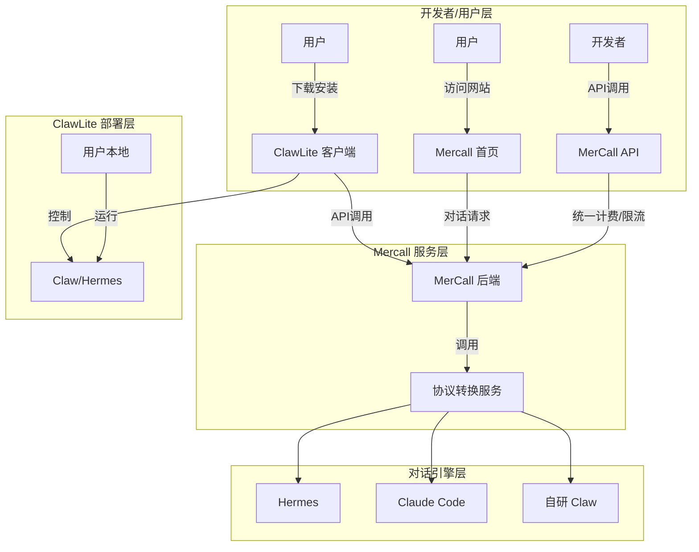
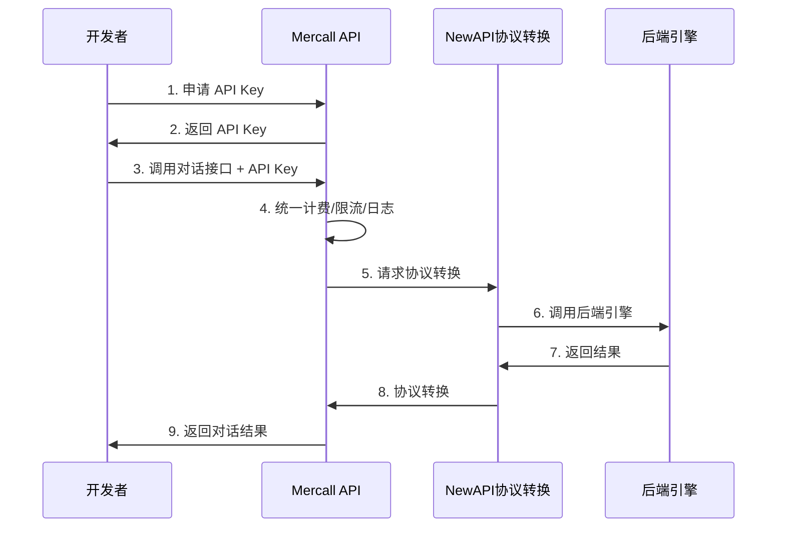
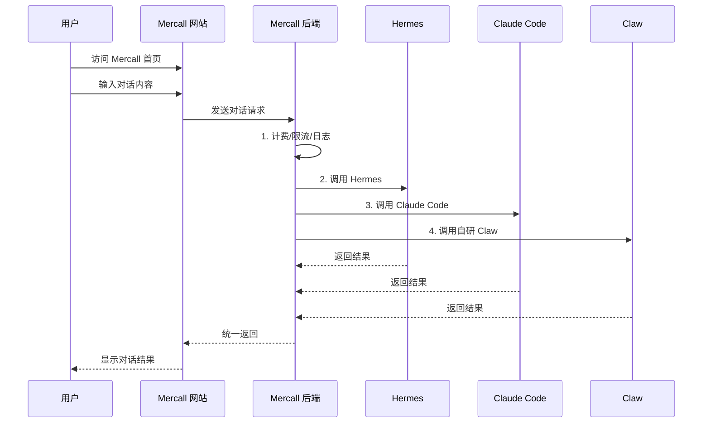
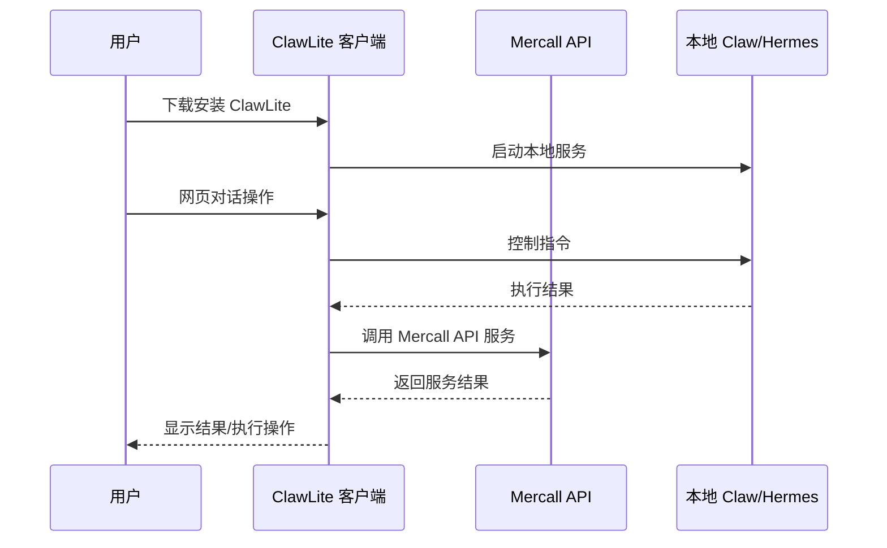
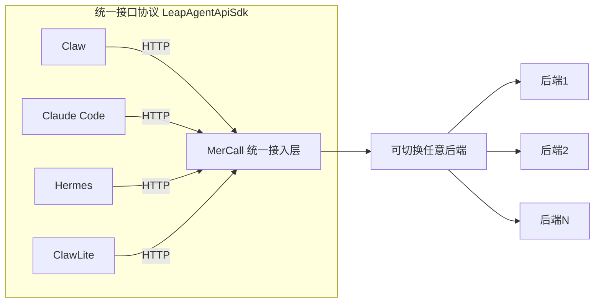

# MercAll Agent 对话能力架构图

## 1. 整体架构概览



## 2. Api 对话流程 (开发者模式)



**流程说明：**
```
┌─────────────────────────────────────────────────────────────────┐
│                      开发者 API 对话流程                         │
├─────────────────────────────────────────────────────────────────┤
│                                                                 │
│   ┌──────────┐    API Key    ┌──────────────┐                │
│   │ 开发者   │───────────────>│  Mercall     │                │
│   │          │<──────────────│  API 服务    │                │
│   └──────────┘                └──────┬───────┘                │
│                                       │                         │
│                                       ▼                         │
│                              ┌────────────────┐                │
│                              │  统一计费/限流  │                │
│                              │  日志统计      │                │
│                              └──────┬─────────┘                │
│                                       │                         │
│                                       ▼                         │
│                              ┌────────────────┐                │
│                              │  NewAPI        │                │
│                              │  协议转换服务  │                │
│                              └──────┬─────────┘                │
│                                       │                         │
│                     ┌─────────────────┼─────────────────┐       │
│                     ▼                 ▼                 ▼       │
│              ┌──────────┐      ┌───────────┐    ┌─────────┐    │
│              │  Hermes  │      │ Claude Code│    │  Claw   │    │
│              └──────────┘      └───────────┘    └─────────┘    │
│                                                                 │
└─────────────────────────────────────────────────────────────────┘
```

## 3. 首页 Agent 对话流程

### 3.1 在线网页对话模式



**模式特点：**
```
┌─────────────────────────────────────────────────────────────────┐
│                    在线网页对话模式                              │
├─────────────────────────────────────────────────────────────────┤
│                                                                 │
│   用户 ──访问──> ┌─────────────────────────────────────┐        │
│                  │        Mercall 网站首页              │        │
│                  │  (类似 Kimi / 豆包)                  │        │
│                  └──────────────────┬──────────────────┘        │
│                                     │                            │
│                                     ▼                            │
│                  ┌─────────────────────────────────────┐       │
│                  │         Mercall 后端                   │       │
│                  │  ┌─────────────────────────────────┐  │       │
│                  │  │  统一管理                       │  │       │
│                  │  │  • 计费                        │  │       │
│                  │  │  • 限流                        │  │       │
│                  │  │  • 日志统计                    │  │       │
│                  │  └─────────────────────────────────┘  │       │
│                  └──────────────────┬────────────────────┘       │
│                                     │                            │
│              ┌──────────────────────┼──────────────────────┐     │
│              ▼                      ▼                      ▼     │
│       ┌────────────┐        ┌────────────┐        ┌──────────┐  │
│       │  Hermes    │        │Claude Code │        │   Claw   │  │
│       └────────────┘        └────────────┘        └──────────┘  │
│                                                                 │
│   功能支持：                                                  │
│   ✓ 文档处理    ✓ PPT制作    ✓ 知识问答                      │
│   ✗ 无访问用户电脑文件功能                                    │
│                                                                 │
└─────────────────────────────────────────────────────────────────┘
```

### 3.2 ClawLite 离线客户端模式



**模式特点：**
```
┌─────────────────────────────────────────────────────────────────┐
│                  ClawLite 离线客户端模式                        │
├─────────────────────────────────────────────────────────────────┤
│                                                                 │
│   用户下载 ──────> ┌─────────────────────────────────────┐       │
│                   │         ClawLite 客户端              │       │
│                   │  (安装包)                             │       │
│                   └──────────────────┬──────────────────┘       │
│                                         │                       │
│                                         ▼                       │
│                    ┌─────────────────────────────────────┐       │
│                    │      用户电脑本地运行                │       │
│                    │  ┌─────────────────────────────┐    │       │
│                    │  │  • 自研 Claw               │    │       │
│                    │  │  • Hermes                 │    │       │
│                    │  │  • 其他 Agent             │    │       │
│                    │  └─────────────────────────────┘    │       │
│                    └──────────────────┬──────────────────┘       │
│                                         │                       │
│                                         ▼                       │
│                              ┌────────────────────┐              │
│                              │   Mercall API      │              │
│                              │   服务             │              │
│                              └────────────────────┘              │
│                                                                 │
│   使用场景：                                                   │
│   ✓ 网页对话操作 Claw                                         │
│   ✓ 控制和访问用户电脑                                        │
│   ✓ 极客使用                                                   │
│   ✓ 企业私有化部署                                             │
│                                                                 │
└─────────────────────────────────────────────────────────────────┘
```

## 4. 接口协议规范 (LeapAgentApiSdk)



**协议规范说明：**
```
┌─────────────────────────────────────────────────────────────────┐
│                  LeapAgentApiSdk 协议规范                       │
├─────────────────────────────────────────────────────────────────┤
│                                                                 │
│   统一的 HTTP 接口规范 ─────────────────────────────────────     │
│                                                                 │
│   ┌──────────┐    ┌──────────┐    ┌──────────┐                │
│   │   Claw   │    │Claude Code│    │  Hermes  │                │
│   └────┬─────┘    └────┬─────┘    └────┬─────┘                │
│        │               │               │                        │
│        └───────────────┼───────────────┘                        │
│                        ▼                                         │
│              ┌─────────────────────┐                             │
│              │   HTTP 统一接口      │                             │
│              │  LeapAgentApiSdk    │                             │
│              └──────────┬──────────┘                             │
│                         │                                         │
│                         ▼                                         │
│              ┌─────────────────────┐                             │
│              │   Mercall 统一       │                             │
│              │   接入层            │                             │
│              └──────────┬──────────┘                             │
│                         │                                         │
│          ┌──────────────┼──────────────┐                         │
│          ▼              ▼              ▼                         │
│    ┌──────────┐   ┌──────────┐   ┌──────────┐                   │
│    │ 后端引擎1 │   │ 后端引擎2 │   │ 后端引擎N │                   │
│    └──────────┘   └──────────┘   └──────────┘                   │
│                                                                 │
│   ClawLite 客户端：                                             │
│   ┌──────────┐    ┌──────────┐    ┌──────────┐                │
│   │ClawLite  │───>│ HTTP     │───>│ 协议接入 │                │
│   └──────────┘    └──────────┘    └──────────┘                │
│                                                                 │
│   优势：                                                        │
│   • 统一的接入接口协议                                           │
│   • 可以切换任意后端                                            │
│   • 标准化开发体验                                               │
│                                                                 │
└─────────────────────────────────────────────────────────────────┘
```

## 5. 完整架构总览

```
┌─────────────────────────────────────────────────────────────────────────────┐
│                           MercAll Agent 对话能力架构                         │
├─────────────────────────────────────────────────────────────────────────────┤
│                                                                             │
│  ┌─────────────────────────────────────────────────────────────────────┐   │
│  │                        开发者 / 用户层                                │   │
│  │  ┌────────────┐   ┌────────────┐   ┌────────────┐   ┌───────────┐  │   │
│  │  │   开发者   │   │  网站用户  │   │下载用户    │   │  ClawLite │  │   │
│  │  │  (API调用) │   │ (在线对话)  │   │ (离线对话)  │   │  客户端   │  │   │
│  │  └─────┬──────┘   └──────┬─────┘   └─────┬──────┘   └─────┬─────┘  │   │
│  └────────┼─────────────────┼────────────────┼───────────────┼────────┘   │
│           │                 │                │               │              │
│           ▼                 ▼                ▼               ▼              │
│  ┌─────────────────────────────────────────────────────────────────────┐   │
│  │                        Mercall 服务层                                │   │
│  │  ┌───────────────────────────────────────────────────────────────┐  │   │
│  │  │                    统一计费/限流/日志统计                        │  │   │
│  │  └───────────────────────────────────────────────────────────────┘  │   │
│  │                               │                                     │   │
│  │                               ▼                                     │   │
│  │  ┌───────────────────────────────────────────────────────────────┐  │   │
│  │  │                  LeapAgentApiSdk 协议转换                     │  │   │
│  │  │                  (NewAPI 协议转换服务)                         │  │   │
│  │  └───────────────────────────────────────────────────────────────┘  │   │
│  └────────────────────────────────┬────────────────────────────────────┘   │
│                                   │                                          │
│           ┌───────────────────────┼───────────────────────┐              │
│           ▼                       ▼                       ▼              │
│  ┌────────────────┐    ┌────────────────┐    ┌────────────────┐          │
│  │    Hermes      │    │  Claude Code   │    │    自研 Claw   │          │
│  └────────────────┘    └────────────────┘    └────────────────┘          │
│                                                                             │
│  ─────────────────────────────────────────────────────────────────────────   │
│                                                                             │
│  ClawLite 离线部署：                                                        │
│  ┌─────────────────────────────────────────────────────────────────────┐   │
│  │  用户电脑                                                              │   │
│  │  ┌─────────────┐    ┌─────────────┐    ┌─────────────────────────┐ │   │
│  │  │ ClawLite    │───>│ 本地 Claw   │◄──│ Mercall API 服务        │ │   │
│  │  │ 客户端      │    │ / Hermes    │    │ (远程调用)               │ │   │
│  │  └─────────────┘    └─────────────┘    └─────────────────────────┘ │   │
│  │         │                  │                                             │   │
│  │         ▼                  ▼                                             │   │
│  │  控制和访问用户电脑                                                   │   │
│  └─────────────────────────────────────────────────────────────────────┘   │
│                                                                             │
└─────────────────────────────────────────────────────────────────────────────┘
```

---

> **图例说明：**
> - `─────>` 表示数据流向
> - 虚线框表示系统模块
> - 粗线表示主要流程路径
